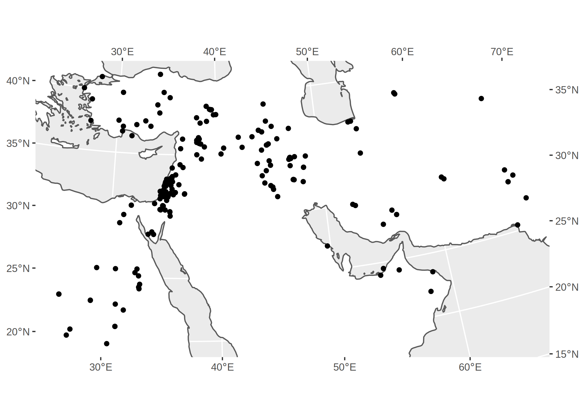

# Uerpmann 1987, *The Ancient Distribution of Ungulate Mammals in the Middle East*, TAVO A27

[](https://zenodo.org/badge/latestdoi/201043108)



This repository contains data from Uerpmann’s (1987), *[The Ancient
Distribution of Ungulate Mammals in the Middle
East](https://reichert-verlag.de/en/author/u/uerpmann_hans_peter/9783882263954_the_ancient_distribution_of_ungulate_mammals_in_the_middle_east-detail)*,
volume 27 of the Tübinger Atlas des Vorderen Orients (TAVO), Series A.

Uerpmann catalogued the occurrence of ungulate taxa in animal bone
assemblages from 196 sites across the Middle East, from the Lower
Palaeolithic to the historic period. Though no longer up-to-date, it
remains one of the most comprehensive resources on quaternary
biogeography in Southwest Asia. Here, the catalogue included in the
volume has been transcribed into a structured format suitable for modern
computerised data analysis.

## Usage

The data is provided in a
[tidy](http://vita.had.co.nz/papers/tidy-data.html), tabular format in
[tavo-a27.tsv](tavo-a27.tsv) (tab-seperated) and
[tavo-a27.csv](tavo-a27.csv) (comma-seperated). Column headings are
given in the first row. The occurrence data is coded as a series of
boolean columns, where `1` indicates the presence of a taxon at a site
and `0` its absence.

Below is a simple example of how to import and visualise the data in R.

``` r
library("tidyverse")
library("sf")
library("rnaturalearth")

tavo <- read_tsv("tavo-a27.tsv", col_types = cols())

# Reshape data into a table of occurrences
tavo %>% 
  gather("taxon", "occurrence", 9:79) %>% 
  filter(occurrence == 1) ->
  tavo

# Recode and filter to selected taxa of interest
tavo %>% 
  mutate(taxon = case_when(
    grepl("Gazella*", taxon) ~ "Gazella",
    grepl("Equus*", taxon) ~ "Equus",
    grepl("Dama*", taxon) ~ "Dama",
    grepl("Ovis*", taxon) ~ "Ovicaprid",
    grepl("Capra*", taxon) ~ "Ovicaprid",
    grepl("Bos*", taxon) ~ "Bos",
    grepl("Sus*", taxon) ~ "Sus",
  )) %>% 
  filter(taxon %in% c("Gazella", "Equus", "Dama", "Ovicaprid", "Bos", "Sus")) ->
  tavo

# Convert to simple features spatial object
tavo %>% 
  drop_na(latitude, longitude) %>% 
  st_as_sf(crs = 4326, coords = c("longitude", "latitude"), remove = FALSE,
           agr = "constant") %>% 
  st_transform(crs = 22770) -> # EPSG:22770 / Syria Lambert
  tavo

# Plot
box <- st_bbox(tavo)
land <- ne_download(110, "land", "physical", returnclass = "sf") %>% 
  st_crop(xmin = 0, xmax = 90, ymin = 0, ymax = 60) %>% 
  st_transform(crs = 22770)

ggplot(tavo) +
  facet_wrap(vars(taxon)) +
  geom_sf(data = land, fill = "white") +
  geom_sf() +
  coord_sf(xlim = c(box$xmin, box$xmax), ylim = c(box$ymin, box$ymax),
           label_axes = "----")
```


## Transcription notes

Generally, the data has been transcribed from the published volume with
mimimal changes. No attempt has been made to update or standardise the
site names, dating, taxonomy, etc., to reflect subsequent research.

### Sites

  - The `id` column corresponds to the numbers assigned to the sites by
    Uerpmann and used in the maps in the volume.
  - Several sites have duplicate ID numbers (Korucutepe, Körtepe,
    Rakefet, Tepecik, Tülintepe). These were reassigned the next IDs in
    the sequence (197–201).

### Periods

  - Uerpmann’s descriptions of the chronology of sites are standardised
    to a list of periods seperated by a semicolon `;`.
  - The acronyms and abbreviations are those used by Uerpmann, viz.:
      - **histor**: historic
      - **Isl**: Islamic
      - **Byz**: Byzantine
      - **Rom**: Roman
      - **Hell**: Hellenistic
      - **IA**: Iron Age
      - **BA**: Bronze Age
      - **LN**: Late Neolithic
      - **EN**: Early Neolithic
      - **PN**: Protoneolithic (i.e. the Pre-Pottery Neolithic)
      - **EP**: Epipalaelithic
      - **UP**: Upper Palaeolithic
      - **MP**: Middle Palaeolithic
      - **LP**: Lower Palaeolithic
  - Time periods joined with a dash are expanded to a list of all the
    intervening periods (e.g. “EP–LN” becomes (“EP;PN;EN;LN”).
  - “+ later” is ignored.

### Coordinates

The locations of the sites are indicated on maps throughout Uerpmann’s
volume, but exact coordinates are not given in the text or catalogue.
The coordinates included in this dataset have therefore been compiled
from various other sources, with citations provided in the
`coord_source` column. See `tavo-a27.bib` for the full references in
BibTex format. They can be assumed to be accurate to within
approximately ±1 km.

### Taxonomy

  - Uerpmann’s various notation for indeterminate species
    (e.g. “cf. *Oryx*”, “*Capra* spec.”, “*Hippotraginae* indet.”)
    are standardised to the form *Genus sp.*
  - All the taxa listed are included; Uerpmann’s commentary on the
    certainty of identification (e.g. “(?)”, “cf.”) is ignored.
  - Taxa not identified to at least the genus (e.g. “large Bovidae”) are
    omitted.

### Bibliographic references

Full references are provided in BibTex format in `tavo-a27.bib`.

  - Citations are given in the data following Uerpmann
  - As noted by Uerpmann, he references “usually only the last (and/or
    key-) publication concerning the respective site”.
  - References to other authors marked “ms.”, “unpub.”, etc. are
    standardised to “pers. comm.”
  - References to (as then) unpublished work by Uerpmann are
    standardised to “Uerpmann 1987” (i.e., the TAVO A27 volume)
  - Additional citations are included in the data for the source of
    coordinates.

## Citation

Please cite Uerpmann’s original volume when using this data:

  - Hans Peter Uerpmann. (1987). *The Ancient Distribution of Ungulate
    Mammals in the Middle East*. Tübinger Atlas des Vorderen Orients
    (TAVO), Reihe A (Naturwissenschaften), Nr. 27. Wiesbaden: Dr. Ludwig
    Reichert Verlag.

You can also cite this specific dataset via
[Zenodo](https://doi.org/10.5281/zenodo.3362928):

  - Joe Roe. (2019). *Data from Uerpmann 1987, The Ancient Distribution
    of Ungulate Mammals in the Middle East, TAVO A27* (Version v1.0)
    \[Data set\]. Zenodo. <http://doi.org/10.5281/zenodo.3362929>

Further citations for specific assemblages are provided in the
`fauna_source` and `coord_source` columns. See `tavo-a27.bib` for the
full references in BibTex format.
